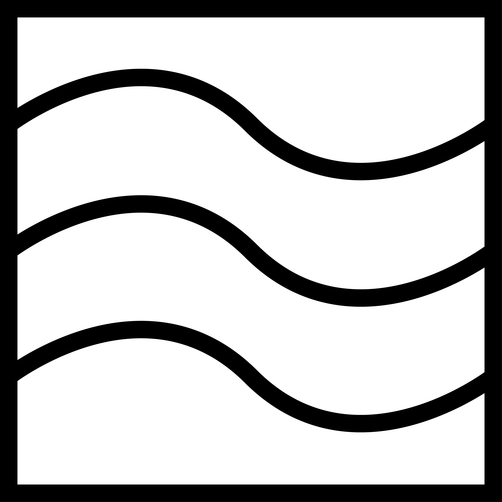
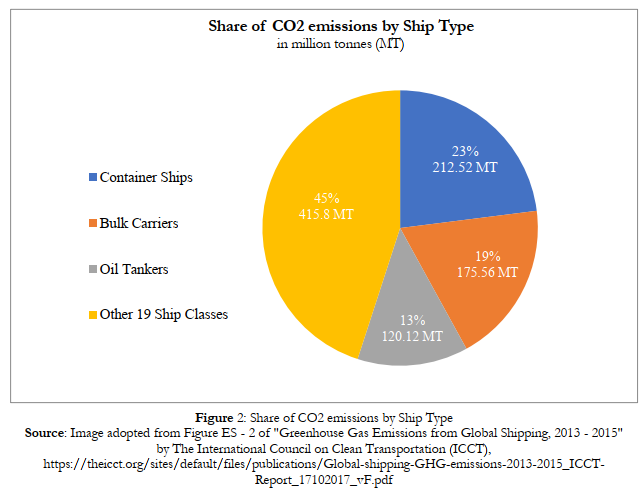
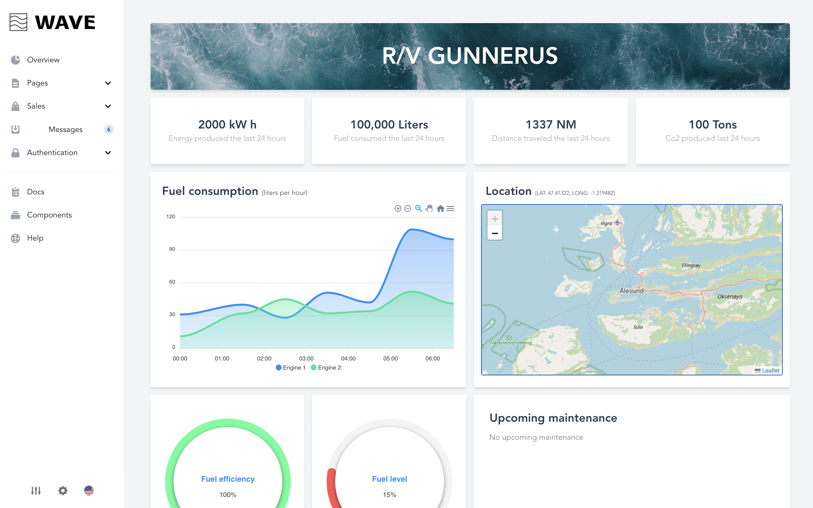
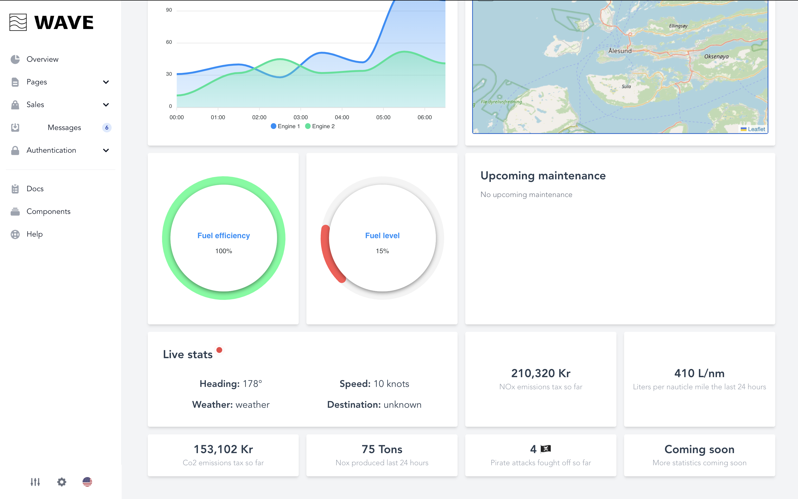
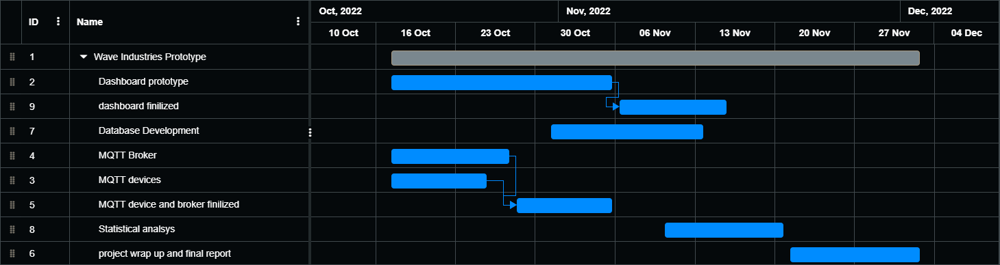
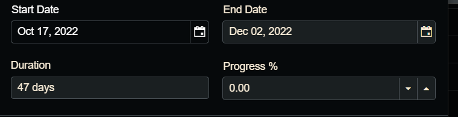
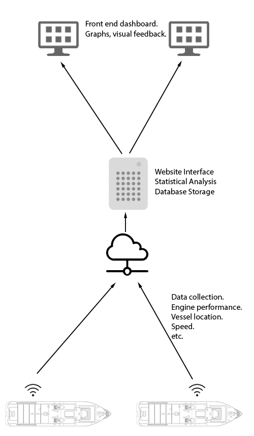
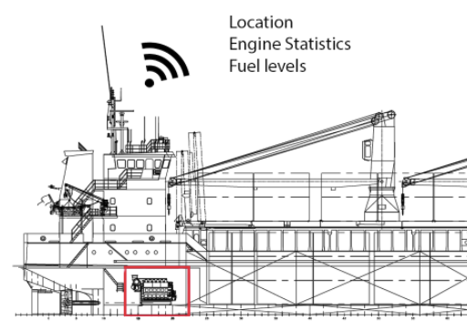
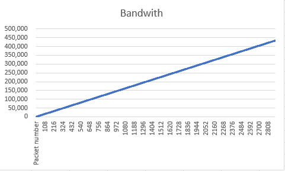

## Table of contents ##
This readme is split in two

the first part is the readme you will find in a standard git repo, explains building the code and standards used

**the secound part is the report to be read by sensor and teachers**

1. [Project Readme](#Readme "go to Readme")
2. [Project report](#report "go to report")

# Project readme #

## wave_frontend ##
Please refeere to wave_frontend [README](wave_frontend/README.md)

## wave_frontend ##
Please refeere to waveBackend [README](waveBackend/README.md)

 - - - -

# Project report #
 ## Authors ##
| Name      | Github username  | Role                                               |
|-----------|------------------|----------------------------------------------------|
| Arunanthi Gunapalan    | nanthi13         | documentation and research                         |
| Gard Huse Storebø | 0xBACE and gardh | MQTT broker developer, documantation, scrum master |
| Henrik Norheim Nysæther | Henriknn01       | Main Developer                                     |
| Rafal Bieniek | Rafixx11         | documentation and research                         |

### Table of Contents ###
1. [Background](#Background "go to Background")
   1. [Wave Industries](#wave "go to wave")
   2. [Introduction to the problem](#problem "go to problem")
   3. [Introduction to the solution](#solution "go to solution")

2. [Research](#Research "go to Research")
   1. [Plans](#plan "go to plan")
   2. [gunnerus and simulator](#sim "go to sim")

3. [Process and workflow](#workflow "go to workflow")
   1. [Organization](#Organization "go to Organization")
   2. [Sprint Work](#Sprint "go to sprint")

4. [Architecture](#Architecture "go to Architecture")
   1. [Overview](#Overview "go to Overview")
   2. [Protocols](#Protocols "go to Protocols")
   3. [Security](#Security "go to Security")

5. [Indepth solution](#solution "go to solution")
   1. [Frontend](#Frontend "go to Frontend")
   2. [Backend](#Backend "go to Backend")
   3. [MQTT and ship](#MQTT "go to MQTT")
   4. [What makes this a good solution](#good "go to good")

6. [Future work](#Future "go to Future")
   1. [Practical](#Practical "go to Practical")
   2. [statistical analysis](#statistical "go to statistical")
   3. [Potential](#Potential "go to Potential")
   4. [Market](#Market "go to Market")

 - - - -

# 1. Background #

# Wave project Video #

https://youtu.be/l-YfQ0mNnrs

## 1.i Wave Industries ##
 

Here at wave industries we strive for the best in IoT Vessel statistics and predictive maintance.
We aim to do statistical analysis of ships in Norway as our preliminary research, but aim to expand this techonology worldwide.
This analysis gives easy access for remote monitoring for land based operator stations.
The access to historical data could lead to more effective ways of doing predictive maintenance.
This does adopt a big data perspective of data analysis, and therefore has huge potential for future statistical analysis.

## 2.ii Introduction to the problem ##
Commercial marine shipping industry is a major contributor to global air pollution, and left without action the industrys emissions are expected to increase 	[[1](https://clearseas.org/en/air-pollution/)]. These emissions can harm human health and our enviornment.
The commerical shipping industry moves approximately 80% of the worlds goods [[2](https://clearseas.org/en/marine-shipping-and-you/)], therefore does your day to day uses rely on the shipping industry to complete its operations efficantly and timeley.
Some papers estimates that the greenhouse gasses release by the shipping industry could increese by 20% to 120% by 2050 [[3](https://www.cedelft.eu/en/publications/download/2445)].
A commercial ship release severl types of climate gasses by burning fuel, such as CO2 NOx and SOx, the shipping industry is resposible for up to 15% of the worlds greenhouse gasses [[1](https://clearseas.org/en/air-pollution/)].
the impact of greenhouse gasses could be detrimental to enviorment and marine life.

## 2.iii Introduction to the solution ##
With our proposed solution we aim to hit a more efficent and green shipping industry.
Wave introduces Management consoles for both the engineering teams and management teams.
Connecting ships together with new technology will lead to a more Economic, efficent and green shipping industry.

this proposed dashboard will give the user insight into statistics of the ship, such as maintanance, greenhouse gas tax and live stats of the engine.

 - - - -

#  2. Research #
A meaningfull application was one of our key points.
Wave Industries has between the group members over 10 years experience in the offshore industry.
Thus aiming for the shipping industry was natural.
To further add to our project we discussed features we needed to hit to include Statistics and databases.

A vessel alerady uses PLC(Programmable logic controller) to gather data about the engine, and uses this data to control systems aboard the vessel.
the thought process is that we hook into this PLC controller to gether data, then process and compress it to send it to centeral server.
The data can then be processed and shown to costumers in an easy-to-understand format.

the MQTT broker we decided to use after some reaserch was mosquitto, We decided to use Mosquitto because of its large knowlage base about config setup, and community help. This made config setup easy to setup in a shorter timespan., 
although we looked at competitors such as HIVE which is aimed mainly at commercial setups.
Hive would likley make more sense to use if we were to scale this project up, sience it includes easy setups for load balance and more security features.

## 2.i Plans ##
Out plan was creating a ship monitoring system using the MQTT protocol.

We first blocked out feature plan of the project in our [FirstDraft](documentation/firstDraft.pdf) document. 
The draft lists challanges that we were expecting for this project, aswell as early architecture drawings of our solutions.
Already at this stage we made a clear GANT diagram to understand how much work is actaully possible in the timeframe given.

## 2.ii gunnerus and simulator ##
Reliable data aqusition was important to fill database with entries.
Gunnerus was a natural choice to simulate data for since its an NTNU ship.
We made a [software platform](waveBackend/BackendServices/ship_simulator.py) that can emulate values from the ship.
This Simulator uses a [Config file](waveBackend/BackendServices/ship_config.json) that makes it easy to setup new ships and configurations.
This allows us to test differnt ship layouts in a rapid test enviorment.

 - - - -

#  3. Process and workflow #
Our approach to this project was refined by our previous experiences of working on projects. We decided to properly organize and structure work around this project from the start to get things done.  Gant chart helped us in the planning phase. A heavy focus was put on having things well structured as well as having everyone up to date with the progress of the project.  

## 3.i Organization ##
Focused on having physical meetings in the start. 
We organized weekly meetings with minimum 1 physical meeting every week and the rest as digital meetings. This was so that we could quickly get started with the project and get everyone on the team up to speed with what that was needed to be done. Later on in the project cycle we would have more digital meetings, to test things like the MQTT broker across the net and not just locally. We mapped out estimated progress by using gant chart. This helped us to not spend too much time on certain things and move on with the project, having constant progress and not let things stagnate. Github and its issue system was also used and it made things simpler since we were already familiar with it. 

The work was devided so everyone could work efficiently. By splitting up the work and letting the easier parts be done by the lesser experienced developers on the team. And the heavy stuff like the web site and simulator be done by the ones with more experience. Our team consisted of 1 main developer. He was already an experienced web dev so he got the task of doing the main parts. 1 scrum master, that focused on documentation and MQTT connection. 2 people to do more documentation, research  and developing the MQTT. That the parts that were hard were discussed in the meeting and solved together as a group.

Our commits were well structured. In the commit message we would write down what files were changed and what that was changed. These commits would be done on a separate branch to keep things more organized. Pull requests were made where another person had to approve so the changes could be merged with the main branch. 

## 3.ii Sprint Work ##
We emphasized on having a working prototype ready by the end of every week.
We used a sprint based system. Scrums would consist of the general agenda of the meeting, what we had done previously, what we are currently working on and discussing future developments. By the end of the week we would have a prototype tested and functional with whatever new features that were added that week. 

see [SprintReport](documentation/SprintReport.pdf) for a week by week update and a retrospective at the bottom of the document

 - - - -

#  4. Architecture #
The MQTT protocol is alerady designed for low-bandwidth solutions in mind. One computer is installed per ship that gathers data abourd the vessel.
The Setup can be costumized to fit the costumers needs aboard the ship. the MQTT client forwards all the data gathered to the broker.
The MQTT subscriber gathers the data from each ship and uses the REST API to forward this into our database running SQLite.
The frontend can then query the data from database for each vessel, and process this into ready graphs in the frontend veiw.

## 4.i Overview ##

Each ship is setup with MQTT clients to send data to the broker via satelite connection, then the subscriber gathers the data to show to the frontend via a webpage.

## 4.ii Protocols ##
MQTT is a lightweight messaging protocol that is widely used in the Internet of Things (IoT) to enable devices to communicate with each other. The protocol is designed to be lightweight, so it uses a simple publish-subscribe model that allows devices to send messages to a broker, which then distributes the messages to the interested parties.

One of the main advantages of MQTT is its low overhead. Because it uses a publish-subscribe model, MQTT requires only a small amount of data to be transmitted between devices, making it ideal for use in low-bandwidth or constrained environments. This also makes MQTT faster and more efficient than other protocols, which can be important in applications where quick communication is critical.
Another advantage of MQTT is its flexibility. The protocol allows for the use of different quality of service (QoS) levels, which can be used to control how messages are delivered. For example, a high QoS level ensures that a message is delivered, even if it takes longer to do so, while a low QoS level allows for faster delivery at the expense of reliability. This flexibility makes MQTT suitable for a wide range of applications and environments.

However, there are also some disadvantages to using MQTT. One of the main drawbacks is that the protocol is not secure by default. Although it is possible to add security to MQTT by using encryption, this must be done manually, which can be time-consuming and error-prone. As a result, MQTT is not always suitable for applications where security is a critical concern.
In addition, MQTT is not as widely supported as some other protocols. While it is widely used in the IoT, it is not as commonly used in other areas, such as in traditional enterprise systems. This can make it more difficult to integrate MQTT-based systems with existing infrastructure.

In our implementation of this setup.
MQTT clients send payloads to different topics on the MQTT broker, this is used to catgorize different parts of the ship,
for example a message could come from /gunnerus/engineroom/temp1
. 
We can see that this message was sent by the gunnerus vessel and the statistics gathered was a temprature sensor from engineroom.

## 4.iii Security ##
There are several ways to add security to an MQTT setup. One of the most common ways is to use encryption, either by using Transport Layer Security (TLS) or Secure Sockets Layer (SSL) to encrypt the communication between the MQTT broker and the clients. This ensures that the data transmitted over the network cannot be intercepted and read by unauthorized parties.
Another way to add security to an MQTT setup is to use authentication. This can be done by requiring clients to provide a username and password before they are allowed to connect to the broker. This ensures that only authorized clients can access the broker and send or receive messages.
It is also possible to use access control lists (ACLs) to control which clients are allowed to publish or subscribe to specific topics. This can be used to limit the access of certain clients to specific parts of the MQTT network, and can be combined with authentication to provide an additional layer of security.

Overall, securing an MQTT setup involves a combination of encryption, authentication, and access control. By using these techniques, it is possible to create a secure and reliable MQTT network that can be used to support a wide range of IoT applications.

however for our setup we only had time to complete the TLS encryption setup, read further in future for more info about plans.

 - - - -

#  5. Indepth solution #
explain system as a whole?

## 5.i Frontend ##
The frontend user interface is a critical component of our system, as it is responsible for showing data to the user. 
We use the Vue.js javascript framework to create reusable components and build complex user interfaces. 
To interact with the backend and retrieve data, we use axios, which is a framework that makes it easy to make HTTP requests. 
When the frontend is loaded, it makes a request to the backend using HTTP to get the data that it needs to serve to the user. 
The backend uses a REST API over a HTTP TCP connection to provide the data to the frontend. Ideally, we would use HTTPS instead of HTTP to provide an extra layer of security.

## 5.ii Backend ##
The MQTT client sends data to a REST API, which is responsible for storing the data in a database.
The database contains a table for each ship, where the sensor data is linked together with the correct ship, allowing the frontend system to easily retrieve and access it when needed.
The REST API acts as an intermediary between the database and the frontend, receiving requests for data and processing, formatting, and sending the data back to the frontend as needed.

## 5.iii MQTT and ship ##
The sensors on a vessel are responsible for gathering various types of data, such as temperature, pressure, and other measurements.
This data is typically collected in real-time, and is used to monitor the ship and ensure its proper functioning.
Once the data has been collected, it is typically stored in a database on the ship's backend system.
This allows the data to be easily accessed and used by the ship's crew

We can either access this data through theyr systems if vendors allow this, or we can gather in real time by accessing the PLC comminications.

The MQTT protocol was created for this porpouse in mind, where bandwitch overhead and packet reliability is the focus.
The MQTT brokers also can use TLS/SSL aswell as password protection to ensure costumer confidentiality.
Scalibilty also is a focus, as we have one broker per costumer

Bandwitdh graph shows the linear estimation of O(n), the packets have a max Bytes of 150 per message, this scales lineary.
This graph shows us that the number of packets needed to cause memory issues is quite large. 

## 5.iiii What makes this a good solution ##

we focused on a real-world problem that is relevant and important today: the need for a more sustainable, environmentally-friendly shipping industry.
We also approached this problem from a unique perspective, and developed a solution that is innovative and practical.
we have a background story that is entertaining and we have a clear understanding of the challenges and opportunities in the shipping industry. 
We used professional tools such as Gantt charts and Git to manage our project, and we worked in sprints to ensure that we stayed on track and made consistent progress.
in additon we used branching and code reviews on merging to ensure the good code got pushed to the main branch.

our solution is designed to be user-friendly and intuitive, so that it can be easily adopted and used by ship owners, operators, and crew members. 
This makes our solution accessible and relevant to a wide range of stakeholders, and ensures that it can be easily integrated into existing systems and processes.
 it addresses a key problem in the shipping industry, and uses advanced technologies to deliver a solution that is practical, effective, and easy to use.

 - - - -

#  6. Future work #
add stuff here

## 6.i Practical ##
Given more time we would have implemented more features and improvements that we did not consider vital for this project.

Authentication to the website and Rest API – To ensure users have access to the data they are trying to view.

Improve Rest API endpoint design/structure – To improve the efficiency of the API calls

Improve security of MQTT by adding features such as password protected connections – To secure the sensitive data relayed by the MQTT client and broker

Make simulator more realistic – To further improve our statistical analysis

Make the backend and frontend setup process more streamlined with the use of containers such as docker – To make the installation process faster in the future

General site improvements such as streamlined expansion of fleets – To further enhance the user experience and the ease of use of the website

Different ways to display the data – To give the user a more in depth view of the data with more ways of visualizing

## 6.ii statistical analysis ##
Predictive maintenance is nothing more than preventative maintenance based on the equipment conditions. There are several ways of estimating equipment conditions such as a function that can calculate the mean time to failure of a component or a system. 
We can also employ condition-based maintenance which is a predictive maintenance scheme that can predict when a failure will occur. In order to do that we could use a recurrent neural network.

For other statistical analysis such as hydrodynamic drag we could use simple statistical models such as linear regression. 

Although we need a good understanding of component behavior before and during a failure in order to estimate these factors so more real-world data and future testing is required.

## 6.iii Market and Potential ##

This software was made with the intention of catering to the marine shipping industry market. Given that 58 000 merchant ships are travelling the sea at all times even the most minor improvements in fuel efficiency could potentially save a lot of money. Additionally, it would help reduce the emissions produced by the shipping industry and could in turn bring in the interest of government organizations interested in benefitting the planet. 

Another potential market would be the Navy. Given the importance of fuel efficiency in the field, due to the inability to know when the next refueling will happen, it’s clear to see how software with the potential to improve that aspect would be highly sought after.

## 6.iiii Challenges  ##

Gaining access to the data from vendors – Even though a vessel is owned by the company that purchased it, the system and component providers own the data from the systems. As this data can contain valuable information, system providers are reluctant to release it.

Developing a signal processing algorithm in order to obtain usable data from flawed input. These flaws can range from wild point in the data as well as frozen signal. 

 - - - -
