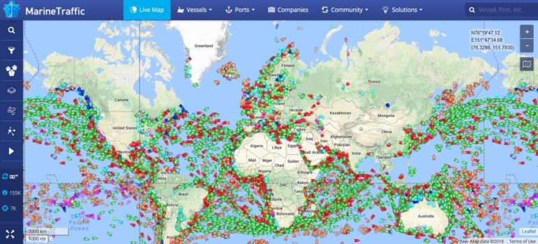

## Table of contents ##
This readme is split in two

the first part is the readme you will find in a standard git repo, explains building the code and standards used

**the secound part is the report to be read by sensor and teachers**


1. [Project Readme](#Readme "go to Readme")
2. [Project report](#report "go to report")


<a name="Readme"></a>
# Project readme #

## wave_frontend

### Project setup
```
yarn install
```

### Compiles and hot-reloads for development
```
yarn serve
```

### Compiles and minifies for production
```
yarn build
```

### Lints and fixes files
```
yarn lint
```

### Customize configuration
See [Configuration Reference](https://cli.vuejs.org/config/).


 - - - -


<a name="report"></a>
# Project report #
 ## Authors ##
| Name      | Github username  | Role                                               |
|-----------|------------------|----------------------------------------------------|
| Arunanthi Gunapalan    | nanthi13         | documentation and research                         |
| Gard Huse Storebø | 0xBACE and gardh | MQTT broker developer, documantation, scrum master |
| Henrik Norheim Nysæther | Henriknn01       | Main Developer                                     |
| Rafal Bieniek | Rafixx11         | documentation and research                         |


### Table of Contents ###
1. [Background](#Background "go to Background")
   1. [Wave Industries](#wave "go to wave")
   2. [Introduction to the problem](#problem "go to problem")
   3. [Introduction to the solution](#solution "go to solution")

2. [Research](#Research "go to Research")
   1. [Plans](#plan "go to plan")
   2. [gunnerus and simulator](#sim "go to sim")

3. [Process and workflow](#workflow "go to workflow")
   1. [Organization](#Organization "go to Organization")
   2. [Sprint Work](#Sprint "go to sprint")

4. [Architecture](#Architecture "go to Architecture")
   1. [Overview](#Overview "go to Overview")
   2. [Protocols](#Protocols "go to Protocols")
   3. [Security](#Security "go to Security")

5. [Indepth solution](#solution "go to solution")
   1. [Frontend](#Frontend "go to Frontend")
   2. [Backend](#Backend "go to Backend")
   3. [MQTT and ship](#MQTT "go to MQTT")
   4. [What makes this a good solution](#good "go to good")

6. [Future work](#Future "go to Future")
   1. [Practical](#Practical "go to Practical")
   2. [statistical analysis](#statistical "go to statistical")
   3. [Potential](#Potential "go to Potential")
   4. [Market](#Market "go to Market")


 - - - -
<a name="Background"></a>
# 1. Background #


<a name="wave"></a>
## 1.i Wave Industries ##
 

Here at wave industries we strive for the best in IoT Vessel statistics and predictive maintance.
We aim to do statistical analysis of ships in Norway as our preliminary research, but aim to expand this techonology worldwide.
This analysis gives easy access for remote monitoring for land based operator stations.
The access to historical data could lead to more effective ways of doing predictive maintenance.
This does adopt a big data perspective of data analysis, and therefore has huge potential for future statistical analysis.

<a name="problem"></a>
## 2.ii Introduction to the problem ##
Commercial marine shipping industry is a major contributor to global air pollution, and left without action the industrys emissions are expected to increase 	[[1](https://clearseas.org/en/air-pollution/)]. These emissions can harm human health and our enviornment.
The commerical shipping industry moves approximately 80% of the worlds goods [[2](https://clearseas.org/en/marine-shipping-and-you/)], therefore does your day to day uses rely on the shipping industry to complete its operations efficantly and timeley.
Some papers estimates that the greenhouse gasses release by the shipping industry could increese by 20% to 120% by 2050 [[3](https://www.cedelft.eu/en/publications/download/2445)].
A commercial ship release severl types of climate gasses by burning fuel, such as CO2 NOx and SOx, the shipping industry is resposible for up to 15% of the worlds greenhouse gasses [[1](https://clearseas.org/en/air-pollution/)].
the impact of greenhouse gasses could be detrimental to enviorment and marine life.


<a name="solution"></a>
## 2.iii Introduction to the solution ##
With our proposed solution we aim to hit a more efficent and green shipping industry.
Wave introduces Management consoles for both the engineering teams and management teams.
Connecting ships together with new technology will lead to a more Economic, efficent and green shipping industry.


this proposed dashboard will give the user insight into statistics of the ship, such as maintanance, greenhouse gas tax and live stats of the engine.

 - - - -


<a name="Research"></a>
#  2. Research #
A meaningfull application was one of our key points.
Wave Industries has between the group members over 10 years experience in the offshore industry.
Thus aiming for the shipping industry was natural.
To further add to our project we discussed features we needed to hit to include Statistics and databases.

A vessel alerady uses PLC(Programmable logic controller) to gather data about the engine, and uses this data to control systems aboard the vessel.
the thought process is that we hook into this PLC controller to gether data, then process and compress it to send it to centeral server.
The data can then be processed and shown to costumers in an easy-to-understand format.

the MQTT broker we decided to use after some reaserch was mosquitto, We decided to use Mosquitto because of its large knowlage base about config setup, and community help. This made config setup easy to setup in a shorter timespan., 
although we looked at competitors such as HIVE which is aimed mainly at commercial setups.
Hive would likley make more sense to use if we were to scale this project up, sience it includes easy setups for load balance and more security features.


<a name="plan"></a>
## 2.i Plans ##
Out plan was creating a ship monitoring system using the MQTT protocol.

We first blocked out feature plan of the project in our [FirstDraft](documentation/firstDraft.pdf) document. 
The draft lists challanges that we were expecting for this project, aswell as early architecture drawings of our solutions.
Already at this stage we made a clear GANT diagram to understand how much work is actaully possible in the timeframe given.


<a name="sim"></a>
## 2.ii gunnerus and simulator ##
Reliable data aqusition was important to fill database with entries.
Gunnerus was a natural choice to simulate data for since its an NTNU ship.
We made a [software platform](waveBackend/BackendServices/ship_simulator.py) that can emulate values from the ship.
This Simulator uses a [Config file](waveBackend/BackendServices/ship_config.json) that makes it easy to setup new ships and configurations.
This allows us to test differnt ship layouts in a rapid test enviorment.

 - - - -


<a name="workflow"></a>
#  3. Process and workflow #
what did we plan to achive workflow vice, sprints and sh

<a name="Organization"></a>
## 3.i Organization ##
add how the team solved tasks, who did what, distrubution and such

<a name="Sprint"></a>
## 3.ii Sprint Work ##
PDF of all sprints here

 - - - -


<a name="Architecture"></a>
#  4. Architecture #
The MQTT protocol is alerady designed for low-bandwidth solutions in mind. One computer is installed per ship that gathers data abourd the vessel.
The Setup can be costumized to fit the costumers needs aboard the ship. the MQTT client forwards all the data gathered to the broker.
The MQTT subscriber gathers the data from each ship and uses the REST API to forward this into our database running SQLite.
The frontend can then query the data from database for each vessel, and process this into ready graphs in the frontend veiw.

<a name="Overview"></a>
## 4.i Overview ##


Each ship is setup with MQTT clients to send data to the broker via satelite connection, then the subscriber gathers the data to show to the frontend via a webpage.

<a name="Protocols"></a>
## 4.ii Protocols ##
The main goal of the MQTT protocol is to reduce overhead of packet transportaion. The MQTT protocol uses the TCP stack as a transmission substrate.
MQTT protocol implements a publish-subscrive paradigm, This decouples a client that sends messages as a publisher and the client that recives as subscriber.
MQTT is an asynchronous protocol, which means it does not block while the client waits.

The main components of MQTT is the MQTT broker. The broaker is dispatching messages to the subscribers.

In our implementation of this setup.
MQTT clients send payloads to different topics on the MQTT broker, this is used to catgorize different parts of the ship,
for example a message could come from /gunnerus/engineroom/temp1
. 
We can see that this message was sent by the gunnerus vessel and the statistics gathered was a temprature sensor from engineroom.


<a name="Security"></a>
## 4.iii Security ##
what did we do to ensure security of application
We used TLS encryption on the messages. Since the data we are handeling can be sensetive such as location this was needed, MQTT broker we used

 - - - -

<a name="solution"></a>
#  5. Indepth solution #
explain system as a whole?

<a name="Frontend"></a>
## 5.i Frontend ##
add knowlage about frontend development, what frameworks, what graphing, what did we achive

<a name="Backend"></a>
## 5.ii Backend ##
add knowlage about backend, how mqtt is talking to application, how is database setup, explain sql stuff

<a name="MQTT"></a>
## 5.iii MQTT and ship ##
Add knowlage about MQTT setup, how its connected on the theoretical ship

<a name="good"></a>
## 5.iiii What makes this a good solution ##
add features that we feel went well, and deserves a higher grade

 - - - -

<a name="Future"></a>
#  6. Future work #
add stuff here

<a name="Practical"></a>
## 6.i Practical ##
Given more time we would have implemented more features and improvements that we did not consider vital for this project.

Authentication to the website and Rest API – To ensure users have access to the data they are trying to view.

Improve Rest API endpoint design/structure – To improve the efficiency of the API calls

Improve security of MQTT by adding features such as password protected connections – To secure the sensitive data relayed by the MQTT client and broker

Make simulator more realistic – To further improve our statistical analysis

Make the backend and frontend setup process more streamlined with the use of containers such as docker – To make the installation process faster in the future

General site improvements such as streamlined expansion of fleets – To further enhance the user experience and the ease of use of the website

Different ways to display the data – To give the user a more in depth view of the data with more ways of visualizing


<a name="statistical"></a>
## 6.ii statistical analysis ##
Predictive maintenance is nothing more than preventative maintenance based on the equipment conditions. There are several ways of estimating equipment conditions such as a function that can calculate the mean time to failure of a component or a system. 
We can also employ condition-based maintenance which is a predictive maintenance scheme that can predict when a failure will occur. In order to do that we could use a recurrent neural network.

For other statistical analysis such as hydrodynamic drag we could use simple statistical models such as linear regression. 

Although we need a good understanding of component behavior before and during a failure in order to estimate these factors so more real-world data and future testing is required.
<a name="Potential"></a>
## 6.iii Market and Potential ##

This software was made with the intention of catering to the marine shipping industry market. Given that 58 000 merchant ships are travelling the sea at all times even the most minor improvements in fuel efficiency could potentially save a lot of money. Additionally, it would help reduce the emissions produced by the shipping industry and could in turn bring in the interest of government organizations interested in benefitting the planet. 

Another potential market would be the Navy. Given the importance of fuel efficiency in the field, due to the inability to know when the next refueling will happen, it’s clear to see how software with the potential to improve that aspect would be highly sought after.


<a name="Challenges"></a>
## 6.iiii Challenges  ##

Gaining access to the data from vendors – Even though a vessel is owned by the company that purchased it, the system and component providers own the data from the systems. As this data can contain valuable information, system providers are reluctant to release it.

Developing a signal processing algorithm in order to obtain usable data from flawed input. These flaws can range from wild point in the data as well as frozen signal. 


 - - - -