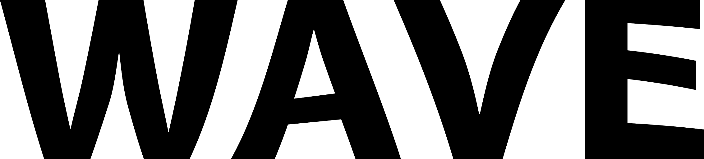

# Project report #
 ## Authors ##
Arunanthi Gunapalan

Gard Huse Storebø

Henrik Norheim Nysæther

Rafal Bieniek

### Table of Contents ###
1. [Background](#Background "go to Background")
   1. [Wave Industries](#wave "go to wave")
   2. [Introduction to the problem](#problem "go to problem")
   3. [Introduction to the solution](#solution "go to solution")

2. [Research](#Research "go to Research")
   1. [Plans](#plan "go to plan")
   2. [gunnerus and simulator](#sim "go to sim")

3. [Process and workflow](#workflow "go to workflow")
   1. [Organization](#Organization "go to Organization")
   2. [Sprint Work](#Sprint "go to sprint")

4. [Architecture](#Architecture "go to Architecture")
   1. [Overview](#Overview "go to Overview")
   2. [Protocols](#Protocols "go to Protocols")
   3. [Security](#Security "go to Security")

5. [Indepth solution](#solution "go to solution")
   1. [Frontend](#Frontend "go to Frontend")
   2. [Backend](#Backend "go to Backend")
   3. [MQTT and ship](#MQTT "go to MQTT")
   4. [What makes this a good solution](#good "go to good")

6. [Future work](#Future "go to Future")
   1. [Practical](#Practical "go to Practical")
   2. [Potential](#Potential "go to Potential")
   3. [statistical analysis](#statistical "go to statistical")
   4. [Market](#Market "go to Market")

 - - - -

# 1. Background #

## 1.i Wave Industries ##
 

Here at wave industries we strive for the best in IoT Vessel statistics and predictive maintance.
We aim to do statistical analysis of ships in Norway as our preliminary research, but aim to expand this techonology worldwide.
This analysis gives easy access for remote monitoring for land based operator stations.
The access to historical data could lead to more effective ways of doing predictive maintenance.
This does adopt a big data perspective of data analysis, and therefore has huge potential for future statistical analysis.

## 2.ii Introduction to the problem ##
Commercial marine shipping industry is a major contributor to global air pollution, and left without action the industrys emissions are expected to increase 	[[1](https://clearseas.org/en/air-pollution/)]. These emissions can harm human health and our enviornment.
The commerical shipping industry moves approximately 80% of the worlds goods [[2](https://clearseas.org/en/marine-shipping-and-you/)], therefore does your day to day uses rely on the shipping industry to complete its operations efficantly and timeley.
Some papers estimates that the greenhouse gasses release by the shipping industry could increese by 20% to 120% by 2050 [[3](https://www.cedelft.eu/en/publications/download/2445)].
A commercial ship release severl types of climate gasses by burning fuel, such as CO2 NOx and SOx, the shipping industry is resposible for up to 15% of the worlds greenhouse gasses [[1](https://clearseas.org/en/air-pollution/)].
the impact of greenhouse gasses could be detrimental to enviorment and marine life.

## 2.iii Introduction to the solution ##
With our proposed solution we aim to hit a more efficent and green shipping industry.
Wave introduces Management consoles for both the engineering teams and management teams.
Connecting ships together with new technology will lead to a more Economic, efficent and green shipping industry.

 - - - -

#  2. Research #
A meaningfull application was one of our key points.
Wave Industries has between the group members over 10 years experience in the offshore industry.
Thus aiming for the shipping industry was natural. 
To further add to our project we discussed features we needed to hit to include Statistics and databases.

## 2.i Plans ##
We first made a plan for 

## 2.ii gunnerus and simulator ##
Reliable data aqusition was important to fill database with entries.
Gunnerus was a natural choice to simulate data for since its an NTNU ship

 - - - -

#  3. Process and workflow #
add stuff here

## 3.i Organization ##
stuff

## 3.ii Sprint Work ##
stuff

 - - - -

#  4. Architecture #
add stuff here

## 4.i Overview ##

## 4.ii Protocols ##
stuff

## 4.iii Security ##
stuff

 - - - -

#  5. Indepth solution #
add stuff here

## 5.i Frontend ##
stuff

## 5.ii Backend ##
stuff

## 5.iii MQTT and ship ##
stuff

## 5.iiii What makes this a good solution ##
stuff

 - - - -

#  6. Future work #
add stuff here

## 6.i Practical ##
if we had more time we would x

## 6.iii statistical analysis ##
stuff

## 6.ii Potential ##
Future plans if this was scaled bigger

## 6.iiii Market ##
what markets could we aim form bla bla bla

 - - - -